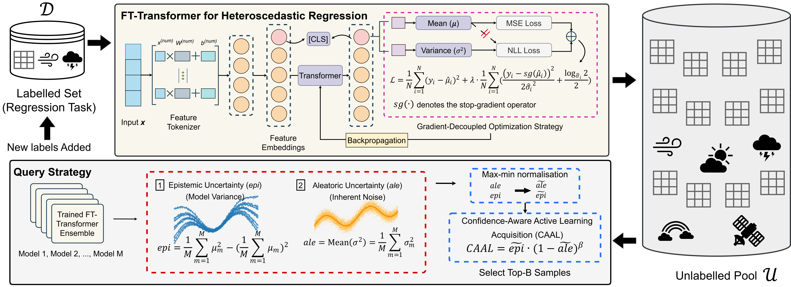

# CAAL: Confidence-Aware Active Learning for Heteroscedastic Atmospheric Regression

#### Authors: Fei Jiang, Jiyang Xia, Junjie Yu, Mingfei Sun, Hugh Coe, David Topping, Dantong Liu, Zhenhui Jessie Li, Zhonghua Zheng

## Introduction
The objectives of this project are:
- A decoupled training objective for heteroscedastic regression that stabilises uncertainty estimation in AL settings.
- A confidence-aware acquisition function that balances epistemic and aleatoric uncertainty for robust sample selection.
- A practical framework for the cost-effective expansion of atmospheric particle property databases, with methodology applicable to other scientific domains where hard-to-measure properties must be inferred from low-cost observations under heteroscedastic conditions.

## Overview


## Project Structure

```bash
code_Confidence-Aware_AL/
│
├── README.md                   # Project documentation (How to run, dependencies)
├── environment.yml            # Python dependencies (torch, pandas, sklearn, etc.)
├── .gitignore                  
│
├── 📁 CAAL_PartMC/             # Group-based, Range [0,1]
│   │  # Logic: Logit-Normal Distribution
│   ├── 📁 PartMC_data/                # Data specific to PartMC
│   │   ├── PartMC_labeled.csv
│   │   ├── PartMC_unlabeled.csv
│   │   └── ...
│   ├── 📁 src/                 # Source code package
│   │   ├── __init__.py         
│   │   ├── models.py           # FT-Transformer & DeepEnsembleAgent
│   │   ├── strategies.py       # Query Strategies (CAAL, BALD, BADGE, Coreset, etc.)
│   │   ├── losses.py           # Loss functions (e.g., Faithful, Beta-NLL)
│   │   └── utils.py            # Metrics, plotting, logging
│   ├── configs.py              # Configuration (Hyperparams, Group settings)
│   └── main.py                 # Entry point for training
│
└── 📁 CAAL_VR/                 # Point-based, Log-Normal, Range > 0
│    │   #  Logic: Log-Normal Distribution
│    ├── 📁 src/                 # Source code package
│    │   ├── __init__.py         
│    │   ├── models.py           # FT-Transformer & Ensemble (Exp/Log output logic)
│    │   ├── strategies.py       # Point-based selection strategies (LCMD, CIS, etc.)
│    │   ├── losses.py           # Loss functions
│    │   └── utils.py            # Metrics (RMSE/R2 calculation), plotting
│    ├── configs.py              # Configuration (Hyperparams, Point settings)
│    └── main.py                 # Entry point for training
```


## Implemented Methods & Baselines

This repository contains an efficient implementation of our proposed framework **(CAAL)** alongside comprehensive adaptations of state-of-the-art (SOTA) baselines.

### Proposed Framework (CAAL)
The codebase includes:
- **Decoupled Training Objective**: A training objective that decouples mean and variance learning (**MSE+lambda·sg(NLL)**).
- **Confidence-Aware Acquisition**: A novel acquisition function (**CIS-Gating** / CAAL) balancing confidence and uncertainty.

### Active Learning Baselines
We provide adaptations of the following query strategies for regression:
- **[BALD](https://arxiv.org/abs/1112.5745)** (Bayesian Active Learning by Disagreement)
- **[BADGE](https://arxiv.org/abs/1906.03671)** (Batch Active Learning by Diverse Gradient Embeddings)
- **[Core-Set](https://arxiv.org/abs/1708.00489)** (Greedy Core-Set Approach)
- **[LCMD](https://arxiv.org/abs/2203.09410)** (Largest Cluster Maximum Distance)
- **[QBC](https://dl.acm.org/doi/10.1145/130385.130417)** (Query-by-Committee via Deep Ensembles)
- **[ALM](https://doi.org/10.1162/neco.1992.4.5.720)** (Uncertainty Sampling / Largest Entropy)
- **Random Sampling** (Lower Bound)

### Optimization & Loss Baselines
To verify the effectiveness of our optimization strategy, we compare against:
- **[Natural Parametrization](https://openreview.net/forum?id=A6EquH0enk)** 
- **[Beta-NLL](https://arxiv.org/abs/2203.09168)** ($\beta$-NLL where $\beta \in [0,1]$)
- **[Faithful Loss](https://arxiv.org/abs/2212.09184)** 
- **[Standard Gaussian NLL](https://arxiv.org/abs/1703.04977)** (Baseline Deep Ensembles)


## Environment Setup
  We recommend using **"[conda](https://docs.conda.io/en/latest/)"** to manage the Python environment.
  
- Install Conda (If not installed)

```bash
# Download and install conda
$ wget https://repo.continuum.io/miniconda/Miniconda3-latest-Linux-x86_64.sh
$ chmod +x Miniconda3-latest-Linux-x86_64.sh
$ ./Miniconda3-latest-Linux-x86_64.sh
# Edit .bash_profile or .bashrc
PATH=$PATH:$HOME/.local/bin:$HOME/bin:$HOME/miniconda3/bin
# Activate the conda system
$source .bash_profile
# OR source .bashrc
```
- Create Python Environment

You can set up the environment using either conda.
```bash
# Create an environment "al" and install the necessary packages
conda env create -f environment.yml
# Activate the "al" environment
conda activate al
```
## How to Run

- Clone the Repository
```bash
# Clone the repository
git clone https://github.com/envdes/code_Confidence-Aware_AL
cd CAAL_PartMC
```

The main entry point is **main.py**. You can configure the Loss Function and Query Strategy.

- Running the Code

✅ Quick Start (Default Settings)

This runs the code using the default values defined in ```configs.py``` (CAAL with CIS Gating strategy):
```bash
python main.py
```

✅ Run Our Proposed Strategy - CIS-Gating (CAAL)

```bash
python main.py --strategy cis_gating --alpha 1.0 --beta 1.0 --loss mse_sgnll --loss_lambda 0.1
```

✅ Run Different Active Learning Strategies

```bash
# Random Sampling
python main.py --strategy random

# BALD (Bayesian Uncertainty)
python main.py --strategy bald
```

✅ Ablation Studies on Loss Functions

```bash
# Baseline 1: Standard Gaussian NLL (Classic Method)
python main.py --loss nll_only --strategy entropy

# Baseline 2: Faithful Loss (Detached Variance)
python main.py --loss faithful --strategy entropy

# Baseline 2: Beta-NLL
python main.py --loss beta_nll --loss_beta 0.5
```


✅ Debugging / Fast Run

If you want to test if the code works without waiting for a full training cycle:
```bash
# Only 2 ensemble models, 5 epochs, smaller batch size
python main.py --n_ensembles 2 --epochs 5 --batch_size 256
```

## Arguments Reference (Configuration)

You can use these flags with `python main.py`.

#### System & Hardware

| Flag | Description | Default |
| :--- | :--- | :--- |
| `--seed` | Random seed for reproducibility. | `42` |

#### Active Learning Strategy

| Flag | Description | Default |
| :--- | :--- | :--- |
| `--strategy` | Strategy name (`cis_gating` (CAAL), `bald`, `entropy`, `random`, `badge`, `clmd`, `aleatoric`, `coreset`, ). | `cis_gating` |
| `--n_queries` | Total number of Active Learning rounds. | `20` |
| `--query_batch_size` | Number of samples to query per round. | `30` |
| `--alpha` | **Alpha** (for cis_gating): Weight for Epistemic uncertainty. | `1.0` |
| `--beta` | **Beta** (for cis_gating): Penalty for Aleatoric uncertainty. | `1.0` |

#### Loss Functions

| Flag | Description | Default |
| :--- | :--- | :--- |
| `--loss` | Loss function (`mse_sgnll`, `mse_nll`, `nll_only`, `faithful`, `beta_nll`, `nature_nll`). | `faithful` |
| `--loss_lambda` | Weight for the uncertainty term in the loss. | `0.1` |
| `--loss_beta` | Weight for beta-NLL. | `0.5` |
| `--detach_grad` | (Flag) If present, detach variance gradients. | `False` |

#### Model & Training

| Flag | Description | Default |
| :--- | :--- | :--- |
| `--epochs` | Training epochs per round. | `100` |
| `--n_ensembles` | Number of models in the Deep Ensemble. | `6` |
| `--lr` | Learning Rate. | `0.0001` |
| `--batch_size` | Batch Size. | `128` |


## Check Results
After the run finishes, check the `./results_modular/` directory:
- `performance.csv`: Contains MSE, R2, and MAE for every round.
- `queried_indices.npy`: The IDs of the data points selected by the strategy.
- `analysis_data/`: `.npz` files containing detailed predictions for plotting.
- `models/`: `.pt` Models saving.